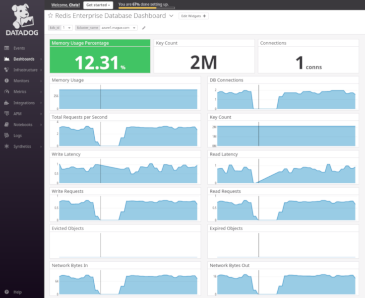

# Datadog Vagrant

How to setup and run a datadog for the redis enterprise prometheus endpoint

## Pre-reqs
1. Ansible [installation](https://docs.ansible.com/ansible/latest/installation_guide/intro_installation.html)
2. Vagrant [installation](https://www.vagrantup.com/downloads.html)
3. Datadog Application key and API key [get here](https://app.datadoghq.com/account/settings)
4. Terraform to setup the dashboard and alerts [get here](https://www.terraform.io/downloads.html)

## Setup Data collection

1. copy ansible/vars/main.yml.example to ansible/vars/main.yml and add the datadog key
2. install the necessary Ansible modules
```
cd ansible && rm -rf roles/* && ansible-galaxy install --roles-path roles -r requirements.yml
```
3. vagrant up

## Use terraform to build dashboards and setup alerts

1. ```cd terraform```
2. ```cp dashboard.tfvars.example dashboard.tfvars```
3. Modify the dashboard.tfvars file to include your API/App keys
4. ```terraform init```
5. ```terraform apply -var-file=dashboard.tfvars```
6. You should be able to view your [dashboard](https://app.datadoghq.com/dashboard/lists)
6. You should be able to view your [monitors](https://app.datadoghq.com/monitors/manage)

## Example Dashboards and Alerts




